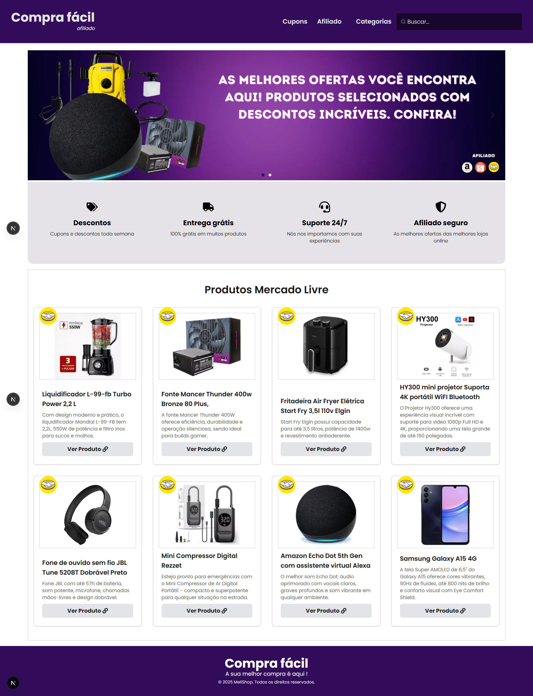

# Site agrupador de links de afiliado

## 📜 Sobre o Projeto

**Compra Fácil** é uma plataforma web simples e eficiente para agrupar e divulgar links de afiliados de grandes empresas como **Mercado Livre**, **Amazon** e **Shopee**. A proposta do projeto é facilitar o acesso e a organização de links de afiliados em um único lugar, com uma interface intuitiva, responsiva e preparada para converter visitantes em comissões de afiliado.

## 🛠️ Tecnologias e Ferramentas

Este projeto foi desenvolvido com as seguintes tecnologias e ferramentas:

- **Next.js**: Estrutura de React para renderização do lado do servidor e criação de sites dinâmicos.
- **Tailwind CSS**: Framework de CSS utilitário para um design responsivo e moderno.
- **Hygraph**: CMS para gestão de conteúdo.
- **React Icons** – ícones vetoriais integrados
- **Vercel**: Plataforma de deploy para aplicações front-end.

## 🚀 Funcionalidades

- Agrupamento de links de afiliado em categorias
- Interface responsiva (mobile-first)
- Integração com links personalizados
- Design moderno com foco em conversão
- Compartilhamento fácil via redes sociais

## 📸 Pré-visualização

### Página Inicial

